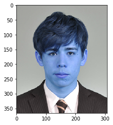
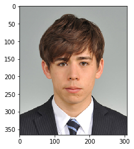
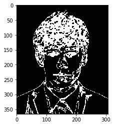
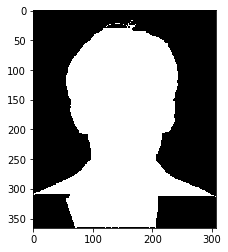
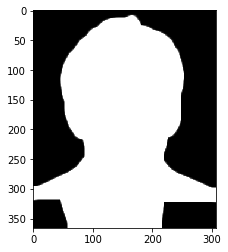
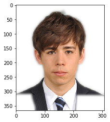
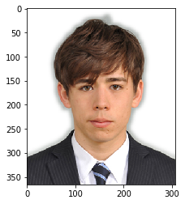

こちらのスタックオーバーフロー回答を元に作成
https://stackoverflow.com/a/29314286

## 今回使用するライブラリ


```python
import cv2
import numpy as np
import matplotlib.pyplot as plt
```

## パラメータの設定
写真によって調整する必要がある


```python
BLUR = 21
CANNY_THRESH_1 = 10
CANNY_THRESH_2 = 100
MASK_DILATE_ITER = 10
MASK_ERODE_ITER = 10
MASK_COLOR = (0.0,0.0,1.0) # In BGR format
```

## 画像を読み込む


```python
img = cv2.imread('sample.jpg')
cv2.imwrite('cv.jpg', img)

plt.imshow(img)
plt.show()
```





OpencvはBGRで読み込むので、そのまま表示してみようとすると色が変なふうになっていまいます。
そのため、以下のように一工夫加えます。


```python
plt.imshow(cv2.cvtColor(img, cv2.COLOR_BGR2RGB))
plt.show()
```





## エッジを見つける

まず、グレースケールの画像を用意します。


```python
gray = cv2.cvtColor(img,cv2.COLOR_BGR2GRAY)

plt.imshow(gray, cmap='gray')
plt.show()
```


```python
#-- Edge detection -------------------------------------------------------------------
edges = cv2.Canny(gray, CANNY_THRESH_1, CANNY_THRESH_2)
edges = cv2.dilate(edges, None)
edges = cv2.erode(edges, None)

plt.imshow(edges, cmap='gray')
plt.show()
```





## 輪郭を見つける


```python
contour_info = []
_, contours, _ = cv2.findContours(edges, cv2.RETR_LIST, cv2.CHAIN_APPROX_NONE)

for c in contours:
    contour_info.append((
        c,
        cv2.isContourConvex(c),
        cv2.contourArea(c),
    ))
contour_info = sorted(contour_info, key=lambda c: c[2], reverse=True)
max_contour = contour_info[0]
```

## 一番大きい輪郭を使ってマスクを作る


```python
#-- Create empty mask, draw filled polygon on it corresponding to largest contour ----
# Mask is black, polygon is white
mask = np.zeros(edges.shape)
cv2.fillConvexPoly(mask, max_contour[0], (255))

plt.imshow(mask, cmap='gray')
plt.show()
```





## マスクをスムージんさせ、３チャネルにする


```python
mask = cv2.dilate(mask, None, iterations=MASK_DILATE_ITER)
mask = cv2.erode(mask, None, iterations=MASK_ERODE_ITER)
mask = cv2.GaussianBlur(mask, (BLUR, BLUR), 0)
mask_stack = np.dstack([mask]*3)    # Create 3-channel alpha mask

plt.imshow(mask_stack, cmap='gray')
plt.show()
```

    Clipping input data to the valid range for imshow with RGB data ([0..1] for floats or [0..255] for integers).





## マスクと背景を合体させる


```python
mask_stack  = mask_stack.astype('float32') / 255.0          # Use float matrices, 
img         = img.astype('float32') / 255.0                 #  for easy blending

masked = (mask_stack * img) + ((1-mask_stack) * MASK_COLOR) # Blend
masked = (masked * 255).astype('uint8')                     # Convert back to 8-bit 

c_blue, c_green, c_red = cv2.split(img)

img_a = cv2.merge((c_red, c_green, c_blue, mask.astype('float32') / 255.0))

plt.imshow(img_a)
plt.show()
```





## パラメータチューニング
結果を見て分かるとおり、パラメータの設定が上手く言っていないようなので、調整します。
これを簡単にするために、上記でやってきたことを一つの関数にまとめます。


```python
def remove_bg(
    path,
    BLUR = 21,
    CANNY_THRESH_1 = 10,
    CANNY_THRESH_2 = 200,
    MASK_DILATE_ITER = 10,
    MASK_ERODE_ITER = 10,
    MASK_COLOR = (0.0,0.0,1.0),
):
    img = cv2.imread(path)
    gray = cv2.cvtColor(img,cv2.COLOR_BGR2GRAY)

    edges = cv2.Canny(gray, CANNY_THRESH_1, CANNY_THRESH_2)
    edges = cv2.dilate(edges, None)
    edges = cv2.erode(edges, None)

    contour_info = []
    _, contours, _ = cv2.findContours(edges, cv2.RETR_LIST, cv2.CHAIN_APPROX_NONE)
    for c in contours:
        contour_info.append((
            c,
            cv2.isContourConvex(c),
            cv2.contourArea(c),
        ))
    contour_info = sorted(contour_info, key=lambda c: c[2], reverse=True)
    max_contour = contour_info[0]

    mask = np.zeros(edges.shape)
    cv2.fillConvexPoly(mask, max_contour[0], (255))

    mask = cv2.dilate(mask, None, iterations=MASK_DILATE_ITER)
    mask = cv2.erode(mask, None, iterations=MASK_ERODE_ITER)
    mask = cv2.GaussianBlur(mask, (BLUR, BLUR), 0)
    mask_stack = np.dstack([mask]*3)    # Create 3-channel alpha mask

    mask_stack  = mask_stack.astype('float32') / 255.0          # Use float matrices, 
    img         = img.astype('float32') / 255.0                 #  for easy blending

    masked = (mask_stack * img) + ((1-mask_stack) * MASK_COLOR) # Blend
    masked = (masked * 255).astype('uint8')                     # Convert back to 8-bit 

    c_blue, c_green, c_red = cv2.split(img)

    img_a = cv2.merge((c_red, c_green, c_blue, mask.astype('float32') / 255.0))

    
    plt.imshow(img_a)
    plt.show()
    return img_a
```


```python
img_fin = remove_bg(    
    path = 'sample.jpg',
    BLUR = 21,
    CANNY_THRESH_1 = 5,
    CANNY_THRESH_2 = 70,
    MASK_DILATE_ITER = 10,
    MASK_ERODE_ITER = 6,
)
```





## 画像の保存

最後に画像を保存して終わりです。


```python
fig = plt.figure(frameon=False)
ax = plt.Axes(fig, [0., 0., 1., 1.])
ax.set_axis_off()
fig.add_axes(ax)
ax = plt.Axes(fig, [0., 0., 1., 1.])
ax.set_axis_off()
fig.add_axes(ax)
ax.imshow(img_fin)
fig.savefig('fin.png')
```


```python

```
